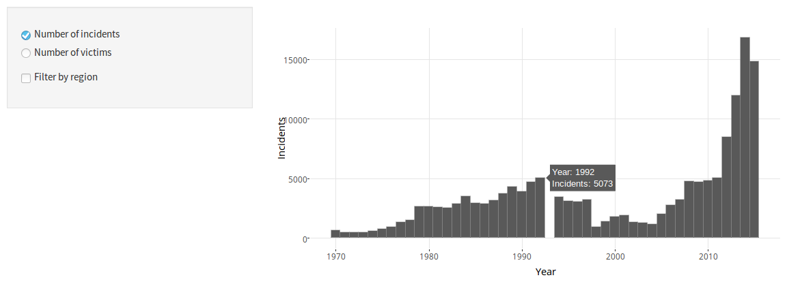
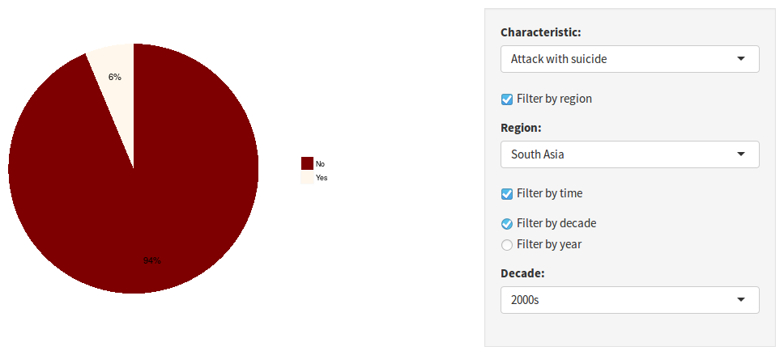
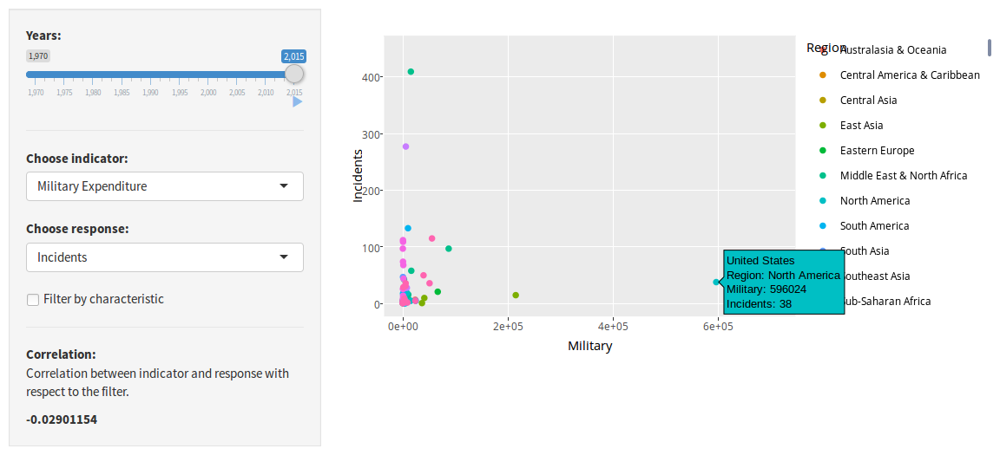

\centering

\vspace*{2cm}

\LARGE{Understand Terrorism}

\vspace*{0.5cm}

\Large{A Statistical Approch using R Shiny}

\vfill

\normalsize{License: Attribution-ShareAlike 4.0 International}
\vspace*{2cm}

\raggedright

\newpage

\tableofcontents

\newpage

# 1. Introduction

In the last weeks and months there were some incidents of terroristic attacks, which where extensively discussed in the media. Examples are the attacks in Paris in late 2015 and the attacks in Nizza, Ansbach and Würzburg in July 2016. By time I found out, that I have not really an understanding what terrorism is. The first step would be a definition:

> "Terrorism is [...] the use or threatened use of violence (terror) in order to achieve a political, religious, or ideological aim." (https://en.wikipedia.org/wiki/Terrorism)

But definitions are broad, so when I was thinking about an indea for a topic of the term paper, there was the idea to have a look if data about terrorism exist. My thought was, that analysing some data would maybe more helpful then to read many opinions. Luckily there is the *Global Terrorism Databse (GTD)* (https://www.start.umd.edu/gtd). This database is an open-source database and it includes information on terrorist events from 1970 to 2015 from all countries around the world.

There are tow ways to analyse such a dataset. One way would be to do a statistically analysis in terms of search for significant correlations, differences and predictors. The other way would be to do it more intuitive with a shiny app. Even if watching to graphs does not hold for scientific statements, it can help to get an intuition, which is much more precise than selected information from media. Finally the decision was taken for a shiny app. Beside the benefeit of intuition, it was just interesting to visualise data in a dynamic way, which I never did before.

The main effort was to write the code, which is extensive commented. This paper will be just an outline of the work. In the *Approach* section it is explained how the code was written an why it was done this way. In the *Discussion and Conclusion* section some possible extensions and alternative approaches are suggested. Finally in this section the success of the shiny app is evaluated, in relation to its goal to find a good intuition for world wide terrorism.

# 2. Method

## Considered Relations

There was no deep literature search in the beginning, but the literature which is dealing with terrorism and especially with predictors of terrorism seems not to be too heterogenous. A paper from Goldstein (2005) concludes that exclusion from the economy and from politics can be a motivator for terroistic attacks. Especially Goldstein found that there are different predictors of terrorism:

  * Political freedom (greates risk countries between liberal democracy and authoritarian control)
  * Linguistic fractionalization and geography
  * Unemployment rate (small influence)
  * Gini Index of economic inequality

Another paper from Piazza (2011) points out that poverty and underdevelopment is not a predictor for terrorism. Piazza took a deeper look into inequality and found out that especially economic descrimination of minorities determines terroristic attacks.

Evaluating these two papers there are multiple possible predictors. Because of availability of data the political freedom and the linguistic fractionalization are not considered. While the effect of the unemployment rate should be very low and the Gini Index of economic inequality is easy to get, the focus was chosen to be the Gini Index. Data were available from *Standardized World Income Inequality Database* (http://fsolt.org/swiid/).

An own theory brought me to the idea, that also military expenditures should be a negative predictor. Nevertheless is military expenditures justified with higher security, so there should be a negative relation between military expenditures and terroristic attacks. Because of some doubt of this relation, it was obvious to check it. There is a dataset available from *Stockholm International Peace Research Institute* (https://www.sipri.org/databases/milex).

At last there were three more datasets from *Worldbank* added. Just to check some standard predictors like population, percentage of people living in urban regions and the gross domestic product (GDP). These datasets were easy to get, well prepared and largly complete. They were taken from *Worldbank* (http://data.worldbank.org/).

As response variables there was not only the amount of incidents, but also the number of victims chosen, to check if there are maybe differences.

But before having a look to the indicators, there are two graphs implementend in the shiny app that just analyse the GTD data, to get an overview of occurences. Especially the amount of attacks and the number of victims per year and per region. Also to check some characteristics of terroristic attacks, which are listed below.

## Discription of Datasets

At that point a short introduction to the datasets and the used variables is necesarry.

### Global Terrorism Database (GTD)

The GTD consits out of 137 columns, where only some are important for this analysis. At that point only the important and used columns are mentioned:

  * `iyear`: The year when the attack took place
  * `country_txt`: The name of the country where the attack took place (e.g. "United Kingdom")
  * `region_txt`: The name of the region where the attack took place (e.g. "North America")
  * `region`: Number of the region (total 12 regions)
  * `success`: If the attack was successful or not successful (e.g. prevented)
  * `suicide`: If the attacker/s did suicide while the attack or not
  * `attacktype1`: The type of attack (e.g. "Bombing/Explosion")
  * `targtype1`: The target of the attack (e.g. "Private Citizens & Property")
  * `nperps`: Number of perpetrators
  * `claimed`: If the attack was claimed or not (e.g. anonymous)
  * `weaptype1`: Type of used weapon (e.g. "Explosives/Bombs/Dynamite")

### Population, Urban percentage, GDP

The datasets from the *Worldbank* (population, urban percentage and gdp) are very simple, they just cointain the countries, the ISO3 of the countries and the corresponding column.

  * `country_txt`: Name of country
  * `country_iso`: ISO3 of country
  * `Year`: The year
  * `Population` / `Urban` / `GDP`: The correpsonding variable

### Military Expenditures

The dataset from the *Stockholm International Peace Research Institute* is contains different information about the military expenditures, but the extracted `csv` just contains the military expenditures in US dollar and is in this form very similar to the datasets from the *Worldbank*.

  * `country_txt`: Name of country (not ISO3)
  * `Year`: The year
  * `Military`: Military expenditure in US dollar

### Ginig Index of inequality

To capture uncertainty of the data, the dataset from *Standardized World Income Inequality Database* contains $100$ data frames of slightly varying data. Every one of them contains 6 columns, where 3 are used:

  * `country`: Name of country (not ISO3)
  * `year`: The year
  * `gini_net`: Gini Index of inequality

## Programmatical Approach

After looking to some projects (especially the shiny app gallery: http://shiny.rstudio.com/gallery/) the speration of code in different files `global.R`, `ui.R`, `server.R` and `preprocessing.R` was obvious. While the `global.R` is just the controller of the processes, the other files are really doing the job. The `preprocessing.R` deals with the data preparation and just contains functions. The `ui.R` and `server.R` create the necessary objects for the shiny app.

### Preprocessing

Depending on the user input, definded in `ui.R`, the server is building the demanded data with getting inputs and calculating outputs, which are returned to `ui.R` again. The calculation has to be done in every single change of the user's input. Therefore in the preprocessing the datasets were prepared as good as possible with the goal that the `server.R` just has to filter data to reduce the calculation effort while working with the app. So for every plot of the three plots there is an own function to prepare the dataset.

While starting these normally all the datasets have to be prepared any time. To reduce the calulculation effort, for some parameters the current data result is stored in a `RData` object. It works like a cache. If the parameters of the data change, the `RData` file has to be removed and the preprocessor has to create a new at the next start.

Overall there are 8 functions in `preprocessing.R`, namely:

#### pasteq()

This function is just a helper function. It uses the `paste` function of the `base` package and just adds the `sep = ""` attribute, so that strings are concatenated without seperation. I decided not to overwrite the `paste` function, to avoid problems in possible later use of the original `paste` function.

#### loadRawResponseFile()

The `loadRawResponseFile` function just loads the GTD dataset. Originally the dataset was stored in `xlsx` excel format. It was originally read by `read.xlsx` from `openxlsx` package. But since reading from `xlsx` files is very slow, the object was directly stored in `RData` file and since then only read from here. For historical reason, the old code (reading from `xlsx`) is still inside of the function, but it is commented out.

To have the possibiblity to return the whole object and to store it in an own chosen name, in the end the return is done with `get(ls()[ls() == "dat"])`,  where `dat` is the name of the object with the dataset. This function reads the local environment inside of the function, filters by the object `dat` and returns the chosen object.

#### loadRawIndicatorFiles()

This function reads all the indicator datasets. The three datasets from *Worldbank* are very similar, there are just small differences while mutating some columns. These datasets exists as `csv` file. Before reading them, they were manually simplified by *Libre Office Calc*. 

The dataset of military expenditures was similar to the Worldbank datasets. Originally it was a messy `xls` file, converted to `csv` and structured using *Libre Office Calc*. Because of missing country ISO3 values, they where manually produced using `countrycode` function from `countrycode` package. Some countries where not detected and therefore just deleted using `na.omit`.

The inequality dataset was directly given as `RData` file, including a detailed handbook. Since the dataset exists out of $100$ data frames with varying data (see above) it is necessary to calculate the mean. And last it was necessary to add the country ISO3 values. Like before alls countries which could not been detected correctly are removed.

For all 5 datasets the package `dplyr` is in use, including `select`, `mutate`, `group_by`, `summarise` and `filter`. Beside of this, the function `melt` from `reshape` package is used. In all datasets (except inequality) the data are in one column per year, which has to be one column for all years.

#### getDataLabels()

It is not user friendly to just see the column names from the databases. It was necessary to assign user friendly names to the variable names. This is done by the `getDataLabels` function. The function is relatively simple, it just manually creates lists of strings. If other columns should be used in the shiny app, theses function must possibly be edited.

#### getFreqData()

To prepare data for the first bar plot, the `getFreqData` function prepares the corresponding dataset with frequencies. Mainly using `dplyr` there are 4 datasets prepared. Two for the number of incidents (one by region, one for the whole world) and two for the amount of victims (again one by region and one for the whole world).

#### getCharData()

To prepare data for the second pie plot, the `getCharData` function prepares the corresponding dataset with characteristics. It selects all chosen characteristics and adds information, so that filtering by region and by time (decades or years) will be possible.

#### getIndiData()

To preapre data for the third scatter plot, the `getIndiData` function prepares the corresponding dataset with the indicators. This can be seen as the main dataset. Inside of this function are 3 local functions which help to deal with the data (details are in the comments of the code). The main idea is to use `dplyr` `full_join` to join all indicator datasets and to join it again with the prepared response dataset (containing the GTD data). In this function the `lapply` function is in use to manipulate all sub-datasets.

#### loadData()

At last there is one function `loadData` which is a higher order function. It calls all the other functions in the corret order. This function is kind of a data management function. Because of its importance and its summarizing character, it is printed here:

```{r eval=FALSE}
loadData <- function(prepDir = "dataset", rawDir = "raw") {
  # higher order function to load all data
  # if is already precomputed, just load the data, if not create it from raw
  #
  # Args:
  #   prepDir: directory where the prepared dataset should be
  #   rawDir: directory where the raw datasets should be
  #
  # Returns:
  #   nothing, but stores the datasets directly into global environment
  
  dataLabels <<- getDataLabels()
  
  filepath = pasteq(prepDir, "/prepared_data.RData")
  if(file.exists(filepath)) {
    load(filepath)
    freqData <<- freqData
    charData <<- charData
    indiData <<- indiData
  } else {
    rawData <- loadRawResponseFile()
    rawIndi <- loadRawIndicatorFiles()
    
    freqData <<- getFreqData(rawData)
    charData <<- getCharData(rawData, names(dataLabels$characteristics))
    indiData <<- getIndiData(rawData, rawIndi)
    
    save(freqData, charData, indiData, file = pasteq(prepDir, "/prepared_data.RData"))
  }
}
```

Fist of all the function has two arguments for file directories, which have default values. As can be seen, the first call is done by creating the labels list. The goal was to have multiple objects, one for every dataset to keep the overview. For this reason the assignment operator `<<-` is used. It brings die object `dataLabels` directly to the global environment. The same is done for all relevant objects below.

In the next step it is checked if the file with the cached data exists. If not it has to run all the preparation functions explained above. This takes some time. After running these functions, the object is stored in the the dataset folder for the next run. If the file is already their, the three objects `freqData`, `charData` and `indiData` are simply loaded. They are relatively small (compared to the raw data), which allows a relaive smooth animation of the plots.

The function can just be run if all the other functions are already loaded. Nevertheless the function is placed on top of `preprocessing.R`, because the whole file is loaded in `global.R` first, so before calling any function all functions are ready, so the position is normally irrelevant. because of the managing character of this function it is placed on top.

### User Interface and Server

The user interface is just one object. It uses functions which build an html page. As theme the *cosmo* bootstrap theme was chosen. Particular attention should be given to the input and output functions, like `selectInput` or `plotlyOutput`, which are the core elements of interaction. Generally at that point it is to say, that the `plotly` package is used. This package makes it possible to have some nie features, like tooltips. For the user it is possible to explore the data, than just watching them. Unfortunately plotly is not possible for pie plots (or it was not possible for me to find out how). So just the first and the third plot is rendered using `plotly`.

Another nice feature is the combination with `ggplot`. Originally the plan was to work with the `googleVis` package using the Google Charts API, inspired by "The Best Stats You've Ever Seen" (TED Talk from February 2016). But on one had, I faced a lot of problems, on the other hand is `ggplot` the package used in the R course, which was the crucial argument in the end. `plotly` made it possible to use `ggplot` in a similar way. The output functions in the `ui.R` file are called `plotlyOutput` (for plot 1 and 3) instead of `plotOutput` for this reason.

The `server` function gets the inputs and sets the outputs. In all cases a `reactive` function is in use. Stricly speaking it is just necessary in the third case. In this case the data are needed for the plot and to calculate the correlation. So it is necessary to get the data filtering out of the output of the plot to avoid redundance. In the first and second plot `reactive` is also used, but just to allow later use of the data at another place. If the app will be changed or further developed, maybe these reactives can interesting for use. In the current case they are not necessary. All reactives mainly operate as filters of data. All the other calculations are relocated to the render functions directly.

The pie plot was the biggest challange in terms of preparation, therefore some words to the second plot generation. A factor can only be created if the number of labels is equal to the umber of levels. Beside choosing the correct labels set from the `dataLabels` object, it is necessary to remove all labels corresponding to not available categories, which is done with the `setdiff` function, see code below.

```{r eval=FALSE}
# find missing factor labels in data and remove them from label list
missingLabels <- setdiff(dataLabels$characteristics[[input$char]]$labels,
                         sort(unique(data[[input$char]])))
if(length(missingLabels) != 0) {
  currLabels <-
    names(subset(dataLabels$characteristics[[input$char]]$labels,
                 !(as.integer(
                   dataLabels$characteristics[[input$char]]$labels
                   %in% missingLabels))))
} else {
  currLabels <- names(dataLabels$characteristics[[input$char]]$labels)
}
```

`dataLabels$characteristics[[input$char]]$labels` contains the theoretically available labels of the current chosen chatacteristic and `sort(unique(data[[input$char]]))` the labels which are available under current filter conditions. The difference will be build by `setdiff` function. If no labels are missing (if the current filtered selection contains all available), the length is zero and the labels are the theoretical labels. If there are missing labels (the length is not zero), a subset is build, which names give the currently available labels.

Also important is the calculation of the percantage of the pie pieces. They are attached to the plot by using `annotate` from `ggplot`. For that reason the position `at` and the percentage text `perLabel` has to be caluculated as follow:

```{r eval=FALSE}
# calculate percentage values for pie pieces to show on every piece
at <- nrow(data) - as.numeric(cumsum(sort(table(pieces)))
                              - 0.5*sort(table(pieces)))
perLabel <- paste0(round(sort(table(pieces))/
                           sum(table(pieces)),2) * 100,"%")
```

Where `pieces` is the factor containing the data. And `data` the whole (filtered) dataset.

At last the colors of the standard palettes just offer 9 different colorings. With the help of `colorRampPalette` it is possible to get a function, which is called `cols`. The `cols` function creates a new coloring of as many colors a necessary based on a given palette.

# 3. Results

In this section the outcome of the code are shown and explained.



## Bar plot with frequencies

In figure 1 the first plot, the bar plot with the frequency data is shown, inluding the input possibilities on the left side. The user can choose between "Number of incidents" and "Number of victims". Optionally the "Filter by region" checkbox can be clicked. At that place a `conditionalPanel` is in use. If the user activates the checkbox, an input selection box will occur and the user can choos the reigion. In figure 2 the filter is active and can be seen in action. If the users hovers a bar (like 1992 in this case) a tooltip with some extra information (the exact number of incidents) show up.

It is important to notice that the y-axis stays constant if the filter is active. With this features comparisons between different regions should be easier.



## Pie plot with characteristics

In figure 2 the second plot, the pie plot with the characteristics data is shown, including the input possiblities on the right side. In this case the user can choose one characteristic. Afterwards optionally it can be filtered by region and/or by time. If filtering by time is active, it can be chosen between average of a decade or single years. In this figure all options are active and the decade filter is chosen.

In this concrete case the pie shows the percentage of attacks with suicide for "South Asia" in the 2000s. 6% were with suicide, 94% not.



## Scatter plot with indicators

In figure 3 the third plot, the scatter plot with the indicators data is shown, including the input possibilities and te correlation on the left side. The user can choose one indicator, one response variable and the year. The user can also animate the plot clicking the play button. It is also possible to filter by some few charateristics. To avoid wrong intuitions the correlation of the current data is also calculated and printed in the left area. If the user hovers one point some extra information appear which should help to orientate and should make the plot more meaningful. The right area is provided by `plotly` and allows to hide/show specific regions.

In the current plot the relation bewteen military expenditure and incidents in the year 2015 are plotted. The correlation is sightly negative.

# 4. Discussion and Conslusion

The shiny app was a great experience so far. Unfortunately the desired intuition was not given as inspected, probably some more work is necessary. Especially the last plot was not as clear as hoped for. There are no strong and unambiguous correlations, the fluctuation between the years is very strong. Probably a look to unemployment rate, poverty and economic discrimination of minorities would be interesting. It could also be that average data (over a decade for example) would give more reliable results. At the other hand all three plots together give a short insight into the complexity of the area of analysing terrorism. Probably this holds for sure.

Another negative point is that its not possible to really understand terrorism in a psychological way by just watching some data. But probably this is not a specific problem of this shiny app, probably this is a general problem with statistics.

Some special improvements would be firstly the pie sorting. Generally it makes sense to arrange the data by frequency. But if the user activates the animation (if the user filters by single years) it is nearly impossible to keep an overview. Some improvement has to be done here.

At last the labels of the axis shouls be optimized, especially in the last plot. In most cases it is not clear which unit is used. E.g. if the user chooses "Military expenditure" as indicator, the x-axis is just "Military", it is not clear which unit is used. Some additions would improve the usibility here.

Genereally the code was written as flexible as possible, so that the cached datasets can be manipulated relatively easy (e.g. choosing different characteristics or add some indicators). In the end the complexity was to big and time to small to achieve a perfect flexibility. There are still some functions using restrinctions which are no arguments.

In the end the main point was to get an insight and a basic understandment of `R` shiny. I'm sure that this goal was successfuly achieved, even if it cost a lot of effort and time. The use of the terrorism dataset was an good motivation, since in every step there where some new interesting things to explore.

# 5. References

## Papers

  * Goldstein, K. B. (2005). Unemployment, inequality and terrorism: Another look at the relationship between economics and terrorism. Undergraduate Economic Review, 1(1), 6.
  * Piazza, J. A. (2011). Poverty, minority economic discrimination, and domestic terrorism. Journal of Peace Research, 48(3), 339-353.

## Databases

  * Global Terrorism Database (GTD): https://www.start.umd.edu/gtd/
  * GDP: http://data.worldbank.org/indicator/NY.GDP.MKTP.CD
  * Population: http://data.worldbank.org/indicator/SP.POP.TOTL
  * Urban Percentage: http://data.worldbank.org/indicator/SP.URB.TOTL.IN.ZS
  * Military Expenditure: https://www.sipri.org/databases/milex
  * The Standardized World Income Inequality Database: http://fsolt.org/swiid/
